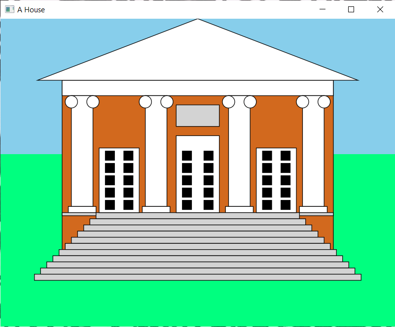
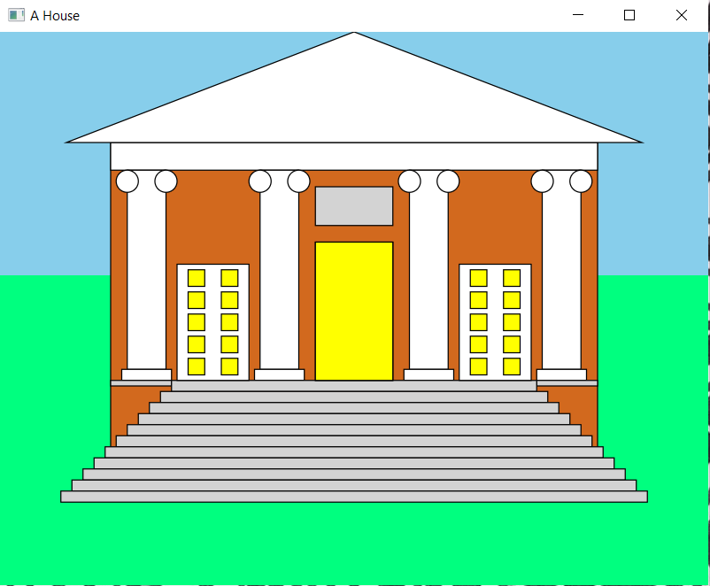
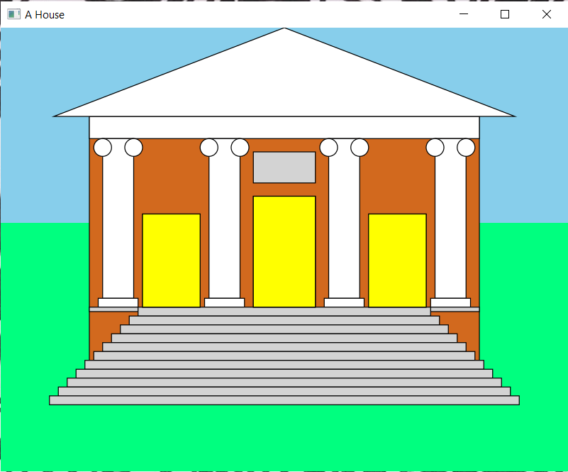

# Week06_GUI_Assignment
Assignment is to create a house in JavaFX, also being interactable

Here is the Application when it is run before any object is clicked, with all the doors closed and the windows dark. House is made up of shape objects and initialized through a utility class

This is the house once the middle door is clicked 3 times. Any door of the house can be clikced 3 times to "open" it and reguardless of which door is opened all the windows of the house will light up

Once all doors have been pressed 3 times and interacted with the house will look like this as a final product
